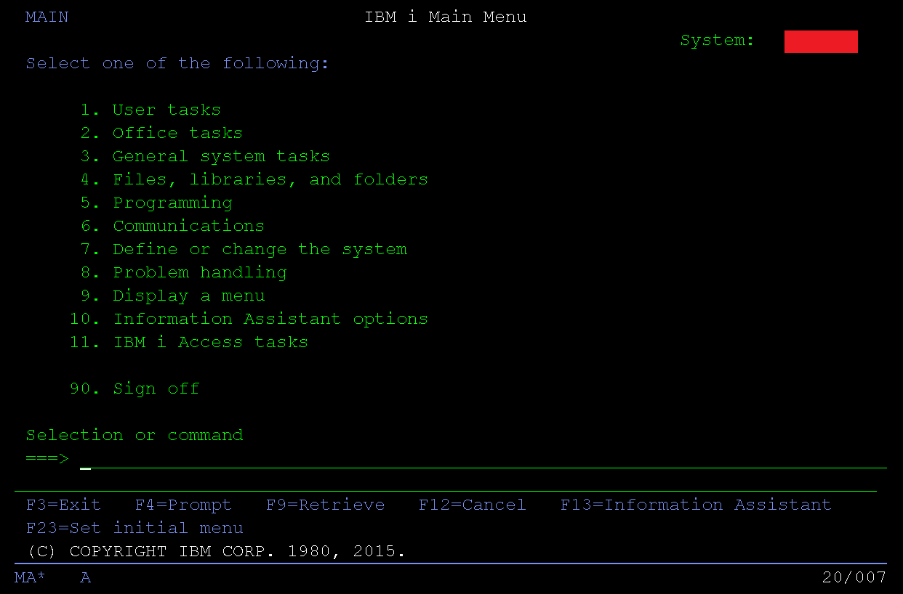

# Learning the IBMi as a Lowly Web Developer

https://barrettotte.github.io/IBMi-Book/

This is a "book" for curious developers to start learning how to program on the IBMi.

 

<figure align="center">
	
	<figcaption align="center">
	</figcaption>
</figure>
